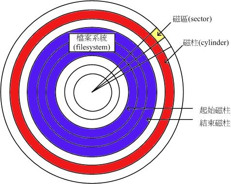

# 磁盘分区
**参考资料：**
* [鸟哥的私房菜 第三版 第三章 主机规划和磁盘分区](http://vbird.dic.ksu.edu.tw/linux_basic/0130designlinux_2.php)
* [linuxprobe.com 第六章 存储结构与磁盘划分](http://www.linuxprobe.com/chapter06/#63)
* [BIOS和CMOS的区别](http://zhidao.baidu.com/link?url=CO_OhTibuoKfy0ZELdDFM0iwlhBIEVzcTzz_4vM0x__K0quIX3-FDYrnIXl8ER2zvOSr9D4QbQ3uWnKvl69f-a)

## 硬盘的组成

硬盘主要由磁盘、机械手臂、磁盘读取头、主轴马所组成。磁盘可细分出扇区/磁区(Sector)与磁柱(Cylinder)两种单位， 其中每一个扇区的大小为512 bytes。如下图：

整个硬盘的第一个磁区特别的重要，因为它记录了整个硬盘的重要信息分别是：

* 主引导记录(Master Boot Record，MBR)：安装启动管理程序的地方，大小为446 bytes。
* 分区表(partition table)：记录硬盘的分区信息，有64 bytes。

磁柱是进行分区时分配空间的最小单位。