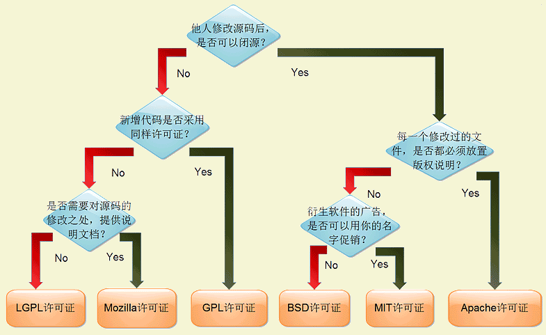

# 最热门的六种开源许可证

Linux 内核和 GNU 工具套件都在 GNU 通用公共许可证（GNU General Public License，GNU GPL）下发行。如果您还不熟悉 GNU GPL，那么理解它的最佳方法就是去阅读它。冒着可能会遗漏某些重要方面的风险，我这样概括 GNU GPL：它是一种使计算机代码可自由使用的方式，使用其代码的用户可随意使用和实验它。

尽管 GNU 通用公共许可证要求将修改过的代码发布给使用该代码的客户，但它不要求将所有修改后的代码都发布给公众（这是某些自由软件的批评者没有领会的关键一点）。的确，对于基于 Linux 的收银机，把代码发布给大众在安全性上完全是一种冒险。GNU GPL 只要求使用代码的客户可以获得修改后的代码。