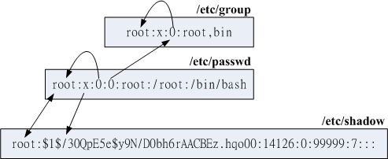

# 账号管理

**问题：Linux如何辨别每一个用户？**

## 相关文件
### /etc/passwd

The  /etc/passwd file is a text file that describes user login accounts for the system. It should have read permission allowed for  all  users(many  utilities,  like ls(1) use it to map user IDs to usernames), but write access only for the superuser.  
Each line of the file describes  a  single  user,  and  contains  seven colon-separated fields:

    name:password:UID:GID:GECOS:directory:shell
    
root用户的UID为0。我们可以将某一用户的UID改为0，从而使之也成为系统管理员。但是不建议这么做。

系统会保留一段UID区间来使用，如[1, 1000)(具体的区间段依赖具体的系统)。这样一来，普通用户的UID就从1000开始算起了。
### /etc/shadow

shadow is a file which contains the password information for the system's accounts and optional aging information. This file must not be readable by regular users if password security is to be maintained.   
Each line of this file contains 9 fields, separated by colons (“:”), in the following order:

    login name
    encrypted password
    date of last password change
    minimum password age
    maximum password age
    password warning period
    password inactivity period
    account expiration date
    reserved field
    
### /etc/group

The /etc/group file is a text file that defines the groups on the system. There is one entry per line, with the following format:

    group_name:password:GID:user_list

The fields are as follows:

    group_name  the name of the group.
    password    the (encrypted) group password. If this field is empty, no password is needed.
    GID         the numeric group ID.
    user_list   a  list  of  the  usernames that are members of this group, separated by commas.
    
### /etc/gshadow

该文件类似于/etc/shadow，其最大的功能是创建用户组管理员。

[**点击查看这几个文件之间的关系**](http://vbird.dic.ksu.edu.tw/linux_basic/0410accountmanager_files/id_link.gif)

### 操作

**为用户组添加新的用户**  
```
    [root@Jarvis-C ian]$ usermod -a -G users ian
    
    // -a 表示append，即将用户加入新的用户组而不会从原来的用户组删除。
    // -G 指定新的用户组。
```

**查看用户所属用户组**

```
    [ian@Jarvis-C ~]$ groups
    ian users

    // 第一个输出的用户组即为有效用户组。
    // 而初始用户组是指在/etc/passwd文件中GID对应的用户组。
```

**切换有效用户组**

```
    [ian@Jarvis-C ~]$ groups
    ian users
    [ian@Jarvis-C ~]$ newgrp users
    [ian@Jarvis-C ~]$ groups
    users ian
```

